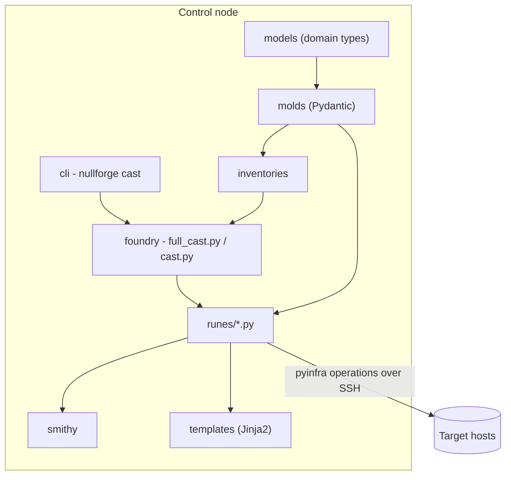

# Architecture

NullForge is a thin, opinionated layer over pyinfra.
Every layer has one job, and imports only flow downward.

## Data flow

1. **Inventories** define hosts and attach `system` and `features` data, built by [merging layers](inventories.md) over the defaults.
2. The **foundry** is the deploy entry point.
   `full_cast.py` coerces inventory data through the molds, always includes `prepare` then `base`, and then includes the rune of every active feature.
   `cast.py` is the selective variant used by `nullforge cast -r ...`.
3. **Runes** are self-contained pyinfra operation sets - one file per concern.
   They read validated configuration from `host.data` and emit idempotent operations.
4. **Molds** are Pydantic schemas for all configuration; [`FeaturesMold`](molds.md) composes the per-feature sub-molds.
5. **Models** hold pure domain types and constants consumed by molds.
6. The **smithy** provides cross-distro abstractions: package-name mapping (apt/dnf), release-binary installs with checksum verification, version pinning, networking facts, swap, service users.
7. **Templates** are Jinja2 files for systemd units, service configs, and shell profiles.

## Layer contracts

The layering is enforced by import contracts:

| Contract | Meaning |
| --- | --- |
| Deploy spine | `cli` -> `foundry` -> `runes` -> `smithy` -> `molds`/`templates` -> `models`; a layer may import only layers below it |
| Models are pure | `models` imports no other NullForge package |
| Templates are a leaf | `templates` imports no other NullForge package, `models` included - its spine position only says which layers may import *it* |
| Molds describe, never provision | `molds` cannot import runes, smithy, or templates |
| Runes are independent | no rune imports another rune |

Why rune independence matters - and how runes coordinate without it - is covered in [Runes](runes.md#independence).

## Execution model

pyinfra runs in two phases:

1. **Plan** - fact gathering and operation collection on the control node.
   Python-level branching (`if host.get_fact(...)`) happens here.
2. **Execute** - the collected operations run against each host, in a deterministic order shared by all hosts.

The [conventions](../contributing/conventions.md) around `host.loop` and change detection exist to keep that shared ordering stable.

## The CLI wrapper

`nullforge cast` is a thin planner around pyinfra: it resolves the [cast stages](../getting-started/cli.md#stages) and hands them to pyinfra.
Everything else - connections, facts, operations, parallelism - is stock pyinfra, which is why unknown CLI options are proxied through verbatim.
