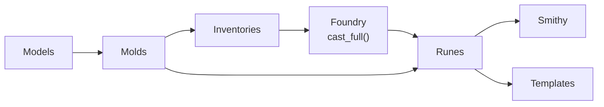

# NullForge

Forge the server's baseline from null.

NullForge is an infrastructure-as-code framework built on [pyinfra](https://pyinfra.com) that provisions Linux servers from a minimal state.
Point it at a fresh host and it takes care of the baseline: packages, locales, users, SSH hardening, firewall, DNS, and a curated set of optional services.

The codebase is themed around a blacksmith's forge:

| Term | What it is |
| --- | --- |
| **Inventories** | Target hosts and their configuration data |
| **Molds** | Pydantic schemas that shape and validate all configuration |
| **Runes** | Self-contained, idempotent pyinfra operation sets - one per concern |
| **Foundry** | The entry points that cast runes onto targets |
| **Smithy** | Cross-distro helpers shared by the runes |

!!! warning "Active development"

    Until the `v1.0.0` release, the CLI, mold schemas and deploy behaviour may change at any time - breaking changes can land in **any** release, including patch versions.
    Pin an exact version (e.g. `nullforge==0.2.0`) and check the [release notes](https://github.com/wlix13/NullForge/releases) before upgrading.

## A cast in one command

```bash
uv tool install nullforge
nullforge cast -i inventory.py
```

Every deploy is idempotent: run it again and only drifted state changes.

## What it manages

Always deployed:

- **Base system** - package baseline, static curl, locales, timezone, NTP, hostname, swap (zram or file), IPv6 stack.
- **Network security** - SSH hardening with post-quantum key exchange, UFW/firewalld, sysctl tuning with BBR.

On by default (opt out per host):

- **Users** - admin user with SSH keys, sudo, zsh.
- **DNS** - [Blocky](https://0xerr0r.github.io/blocky/) DNS-over-HTTPS proxy, or DNS-over-TLS via systemd-resolved.
- **Shell profiles** - oh-my-zsh, starship, tmux, neovim (NvChad), eza, zoxide, direnv, atuin.

Opt in per host:

- **Cloudflare WARP** - MASQUE (usque) or WireGuard (wgcf) engines.
- **Zero Trust Tunnel** - cloudflared with optional WARP routing.
- **Containers** - Docker with gVisor runtime, or Podman with crun.
- **Monitoring** - Nezha agent with dashboard name sync.
- **HAProxy**, **Xray-core**, **Tor**, **Telemt** (MTProto proxy).

See the [feature reference](features/index.md) for the full activation matrix.

## How it fits together



Inventories attach `system` and `features` data to each host.
The foundry validates that data through the molds, then includes the rune for every active feature.
Runes read their configuration from `host.data` and lean on the smithy for cross-distro package logic and pinned-binary installs.

Start with the [installation guide](getting-started/installation.md), then walk through the [quickstart](getting-started/quickstart.md).
